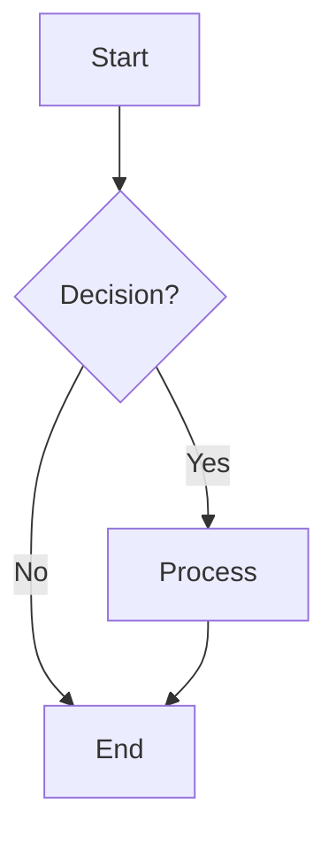
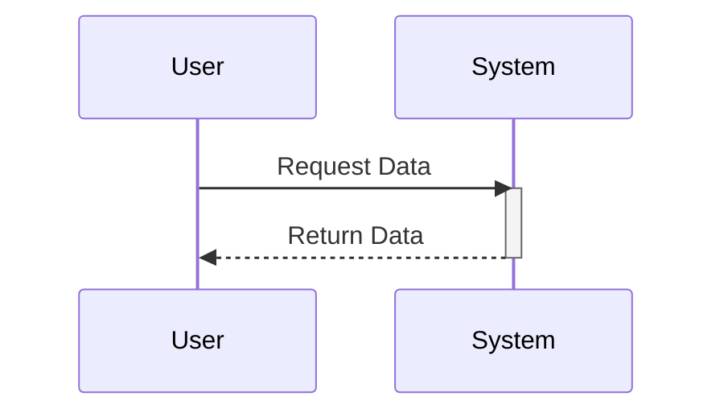
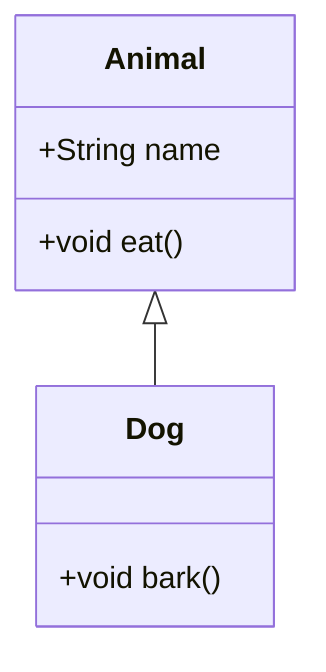
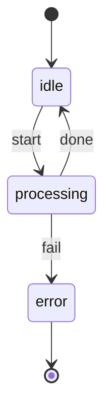

# Mermaid Syntax Reference

## Safe Syntax (Cursor-compatible)

Follow these rules so diagrams render correctly in Cursor and avoid parse errors.

- **Node IDs**: No spaces. Use `camelCase`, `PascalCase`, or underscores (e.g. `userNode`, `LoadBalancer`, `api_gateway`). Do not use reserved IDs: `end`, `subgraph`, `graph`, `flowchart`.
- **Labels with special characters**: Use double-quoted labels for text containing parentheses, commas, or colons (e.g. `A["Process (main)"]`, `B["Step 1: Init"]`).
- **Edge labels with special characters**: Wrap in quotes (e.g. `A -->|"O(1) lookup"| B`).
- **Subgraphs**: Use explicit ID and label: `subgraph id [Label]` (e.g. `subgraph backend [Backend]`). Do not use spaces in the subgraph ID.
- **Theme**: Avoid explicit colors or `style`/`classDef` fill so the renderer can apply theme colors.

---

## Flowchart

- **LR**: Left-to-Right layout
- **TD**: Top-Down layout
- `{}`: Rhombus (Decision)
- `[]`: Rectangle (Process)
- `()`: Rounded Rectangle
- Use quoted labels when the label contains special characters.

## Sequence Diagram

- `->>`: Solid line with arrow (Sync call)
- `-->>`: Dashed line with arrow (Async reply)
- `activate`/`deactivate`: Lifeline status
- Keep participant names without spaces; use PascalCase or camelCase.

## Class Diagram

- `<|--`: Inheritance
- `+`: Public
- `-`: Private

## State Diagram

- `[*]`: Start or end state
- `-->`: Transition; use `: label` for transition text
- State names: prefer single words or camelCase; use quoted labels if needed (e.g. `"In Progress"`)

---

## Other diagram types (reference)

- **ER**: Entity-relationship with `erDiagram` and `ENTITY { }` blocks
- **Gantt**: `gantt` with `title`, `dateFormat`, and section/task lines
- **Pie**: `pie` with `title` and `"label" : value` pairs
